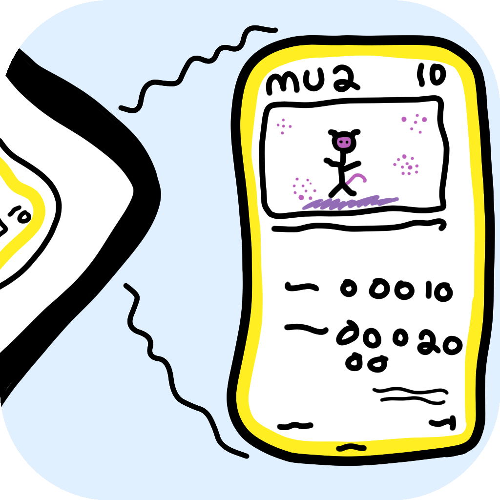

Miror is a card scanner and collection manager for Pokemon TCG collectors. Point
the camera at a card, let Miror identify it, save the scan, track the copy you
actually own, and keep the collection useful after the card is off the table.

Miror is designed to remain useful without requiring an account or a constant
connection. Card recognition runs on-device, collection data belongs to the user,
and local sharing should feel as natural as showing someone the cards in your
binder.

## Source availability

Miror is being made source available in stages. **Only Miror Link is currently
source available in this repository**, together with the narrow collection
manifest and signed-content boundaries needed for its peer-facing behavior.

This is the production Miror Link implementation used by the application, not a
separate demonstration or simplified reference version. The rest of the Miror
application—including the scanner, general collection-management code, and most
application screens—remains private for now.

## Miror Link

Miror Link lets two people nearby connect directly and browse read-only views of
each other's card collections without copying a share code or sending the
collection through a Miror server.

When a nearby match is clear, Miror connects automatically. If several plausible
people are nearby, it asks the user to choose. Optional local card photos are
requested as cards are viewed, and either side can turn photo sharing off.

Link can also offer a newer signed Miror content release to the other device. The
receiving user must approve the transfer, and the package must pass Miror's normal
signature and content checks before anything can be installed.

[Read more about Miror Link](docs/miror-link/README.md)

## What Miror does

- identifies Pokemon cards through the device camera;
- tracks physical copies, printing types, condition, grading, notes, tags, and
  local scan images;
- keeps the collection and card catalog useful offline;
- supports collection backup, restore, and compact Miror Sigil sharing;
- supports direct nearby collection browsing through Miror Link.

Android is Miror's current primary release platform. Miror shares much of its
application code with iOS through Kotlin Multiplatform, but Miror Link is not yet
enabled on iOS.

## Content releases

Miror content packages are published separately from application releases. Their
catalog, embedding gallery, ID manifest, and version are covered by one official
signature. The public verification keys and verification format used by Miror
Link are included in this repository.

## License

The source published here is provided under the terms in [LICENSE](LICENSE).
