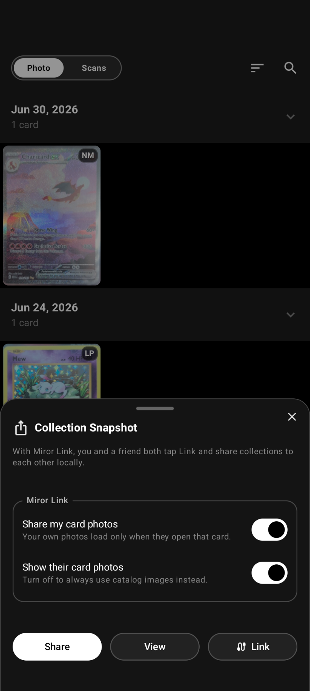
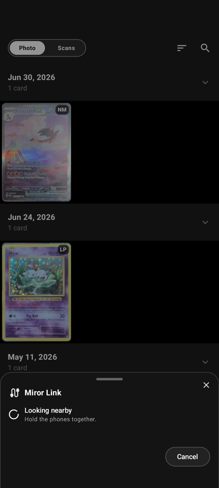
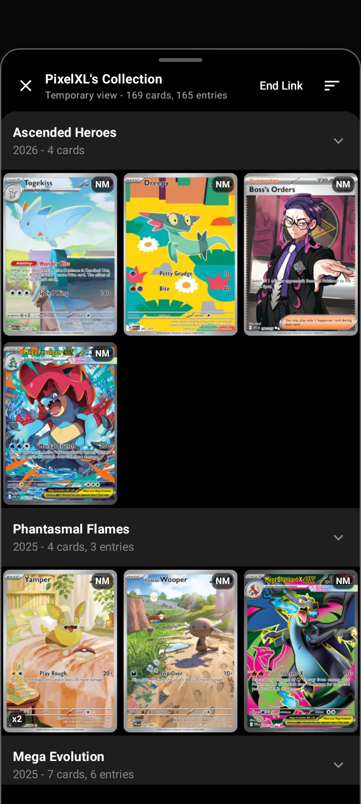
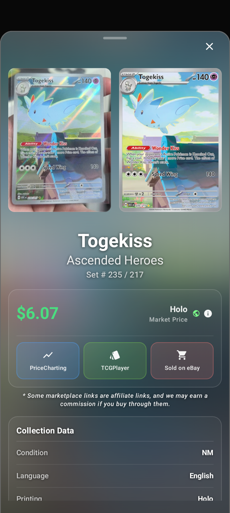

# Miror Link

Miror is a card scanner and collection manager for Pokemon TCG collectors. Point
the camera at a card, let Miror identify it, save the scan, and keep track of the
physical collection that is actually in your hands.

Miror Link brings that collection with you. Two nearby people can
connect directly, exchange read-only collection views, and browse each other's
cards without copying a share code or sending their data through any
server.

## How Link works

Both people choose a nickname and open Link from Miror's sharing screen. When one
nearby match is clear, Miror connects automatically. If several people are close
enough to be plausible matches, it asks the user to choose instead.

Once connected, each person receives a read-only view of the other's shared
collection. Either side can open cards and move through the collection normally.
Local card photos are requested only as they are viewed, and sending or receiving
those photos can be disabled independently.

Link is deliberately temporary:

- it operates only while the Link experience is active in the foreground;
- it uses ephemeral session identifiers rather than accounts or permanent device
  identities;
- ending Link releases the nearby connection and removes temporary received
  photos and transfer staging;
- the received collection remains available to browse for the rest of the local
  viewing session.

## Miror Link in use

<table>
  <tr>
    <th>Start from collection sharing</th>
    <th>Find a nearby collector</th>
  </tr>
  <tr>
    <td></td>
    <td></td>
  </tr>
  <tr>
    <th>Browse their shared collection</th>
    <th>View local photos on demand</th>
  </tr>
  <tr>
    <td></td>
    <td></td>
  </tr>
</table>

## Local content sharing

If one person has newer Miror card data, Link can offer that content release to
the other device. The receiving user decides whether to accept it; a nearby peer
cannot silently install an update.

Relayed content uses the same signed package format as Miror's published content
releases. The card catalog, embedding gallery, ID manifest, and release version
are covered by one official signature. A phone can relay that proof, but it cannot
create a valid replacement or alter the signed files.

Unsigned, modified, mismatched, incomplete, implausibly versioned, and rollback
packages are rejected before installation. The public verification keys and the
code defining the signed message are included here so published content packages
can be checked independently of the phone carrying them.

## Privacy and safety model

Collections and optional card photos travel directly between nearby devices.
Miror does not add accounts, persistent peer identities, or a pairing code
to Link. Without an out-of-band identity comparison, a nearby participant can
impersonate another nearby participant; Link therefore treats the connection as
temporary and untrusted, and never treats it as authority for durable content.

Peer-controlled input is bounded throughout the protocol. Link limits discovery
time, tracked peers, frame and manifest sizes, photo requests and assemblies,
image dimensions, content staging, and transfer duration. Replayed or duplicate
messages do not extend a session. Received photos are validated before decoding
and remain temporary. Durable content must pass the official signature and
package checks before it can reach the application catalog.

## Platform status

Android is the currently supported Miror Link platform.

The shared Kotlin implementation and Swift-facing iOS transport are included here.

## Source layout

The implementation is under:

- `composeApp/src/commonMain/kotlin/com/selenite/scanner/link/`
- `composeApp/src/androidMain/kotlin/com/selenite/scanner/link/`
- `composeApp/src/iosMain/kotlin/com/selenite/scanner/link/`
- `iosApp/iosApp/MirorLink/`

The published source also includes the collection-field mapper and compact
manifest codec used for collection exchange, plus the content verifier and
installation gate reached by locally relayed updates. Those adjacent files are
included because they determine what a peer can receive and whether any received
bytes may affect durable application state.
